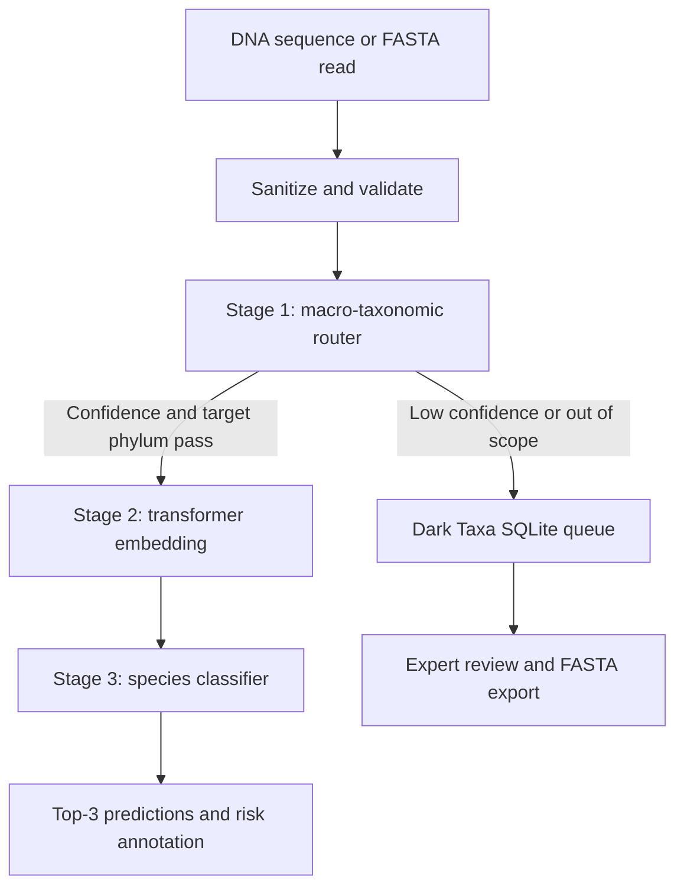

Markdown  
# BioSentinel

### Multi-stage eDNA classification, novelty triage, and biosecurity review

BioSentinel is a Streamlit workbench for turning environmental DNA (eDNA) reads into an explainable triage decision. It combines a nucleotide foundation model, a lightweight species classifier, and a persistent review queue so that uncertain reads are surfaced for expert analysis instead of being forced into a confident-looking species label.

> Built for biodiversity monitoring, deep-sea ecology, and aquatic biosecurity workflows.

## What it does

- Validates and sanitizes raw DNA or FASTA-style input.
- Routes reads through a macro-taxonomic confidence and novelty gate.
- Extracts attention-masked mean-pooled embeddings with `InstaDeepAI/nucleotide-transformer-v2-50m-multi-species`.
- Predicts among 25 configured marine, deep-sea, and pathogen-associated taxa.
- Displays the top prediction, confidence, full probability distribution, and top-three candidates.
- Assigns contextual risk labels such as ecological indicator or critical biosecurity alert.
- Stores low-confidence reads in a SQLite Dark Taxa Review Queue with GC content, entropy, status, notes, and FASTA export support.

## Architecture



### Pipeline stages

1. **Macro routing and novelty gate**: mean-pools transformer hidden states, estimates superkingdom and target-phylum probabilities, calculates Shannon entropy, and forwards only reads that meet the configured confidence threshold.
2. **Biological representation**: creates a fixed-size embedding from the frozen Nucleotide Transformer. The exact dimension is read from the downloaded model configuration.
3. **Species classification**: applies the serialized scikit-learn classifier and label encoder, then reports probabilities and the top three candidate species.
4. **Review and biosecurity**: flags uncertain reads, records them in SQLite, and annotates recognized species with ecological or pathogen-risk categories.

## Current scope

The bundled dataset and classifier cover 25 taxa across seven broad groups:

| Group | Examples |
| --- | --- |
| Annelida | *Riftia pachyptila*, *Alvinella pompejana* |
| Mollusca | *Bathymodiolus thermophilus*, *Architeuthis dux* |
| Arthropoda | *Kiwa hirsuta*, *Calanus finmarchicus*, *Euphausia superba* |
| Cnidaria | *Lophelia pertusa*, *Corallium rubrum* |
| Chordata | *Gadus morhua*, *Salmo trutta*, *Cyprinus carpio* |
| Echinodermata | *Enypniastes eximia*, *Benthodytes sanguinolenta* |
| Biosecurity targets | *Vibrio parahaemolyticus*, *Aeromonas hydrophila*, *Fusarium oxysporum* |

The included synthetic/curated dataset uses a `sequence` column and a `species` column. It is intended for a working demonstration and model-development baseline, not as a universal reference database.

## Repository layout

```text
sih/
├── app.py                         # Streamlit application
├── train_pipeline.py              # Embedding, model selection, evaluation, and export
├── sihdata.py                     # Example dataset generator and taxonomy registry
├── edna_clean_dataset.csv         # Training dataset
├── sample_edna.fasta              # Example FASTA reads
├── edna_classifier.joblib         # Serialized best classifier
├── species_encoder.joblib         # Species label encoder
├── classification_report.txt      # Evaluation report from training
├── src/
│   ├── taxonomic_router.py        # Stage 1 routing and entropy gate
│   ├── embedding_extractor.py     # Stage 2 embedding and cache logic
│   └── dark_taxa_store.py         # SQLite queue and FASTA export
├── requirements.txt
└── readme.md
```

Runtime files such as `dark_taxa_queue.db` and cached `.npy` embeddings are generated locally and are excluded by `.gitignore`.

## Quick start

### 1. Create an environment

Python 3.10+ is recommended. From the project directory:

```bash
python -m venv .venv
```

Activate it on Windows PowerShell:

```powershell
.venv\Scripts\Activate.ps1
```

Activate it on macOS or Linux:

```bash
source .venv/bin/activate
```

### 2. Install dependencies

```bash
python -m pip install --upgrade pip
pip install -r requirements.txt
```

The first run downloads the Nucleotide Transformer weights from Hugging Face. A CUDA-enabled PyTorch installation can be used when available; otherwise inference runs on CPU.

### 3. Launch the workbench

```bash
streamlit run app.py
```

Open the local URL shown by Streamlit, paste a DNA sequence or FASTA-style read, choose the novelty threshold, and run the genomic pipeline.

## Training and evaluation

To regenerate embeddings, compare classifier families with stratified cross-validation, select the best model by macro-F1, and overwrite the serialized model artifacts:

```bash
python train_pipeline.py
```

The training script:

- validates the dataset and removes unusable rows;
- caches transformer embeddings and invalidates them when the dataset changes;
- compares Logistic Regression, Random Forest, MLP, and RBF-SVM candidates;
- evaluates top-1 accuracy, top-3 accuracy, macro-F1, and a classification report;
- writes `edna_classifier.joblib`, `species_encoder.joblib`, `classification_report.txt`, and `confusion_matrix.png`.

To regenerate the bundled demonstration dataset instead:

```bash
python sihdata.py
```

This writes `sample_edna.fasta` and `edna_clean_dataset.csv` using the taxonomy registry in `sihdata.py`.

## Model and data notes

- Input reads are designed around short amplicons. The UI warns outside the 200–500 bp target range, while the transformer tokenizer truncates long inputs to its configured maximum token length.
- The router is a confidence gate built on transformer representations and in-code probe weights. It should be treated as a triage mechanism, not as a validated taxonomic reference method.
- A species prediction is limited to the classes represented in the serialized classifier. Unknown organisms should be reviewed rather than interpreted as confirmed absence.
- The reported confidence is model probability, not a guarantee of taxonomic correctness. Validate important findings with an appropriate reference database and laboratory workflow.
- The bundled data and generated mutations are suitable for development and demonstration. Benchmark against independent, representative field data before operational use.

## Technology

Python, Streamlit, PyTorch, Hugging Face Transformers, scikit-learn, NumPy, pandas, Biopython, joblib, and SQLite.

## License

Copyright © 2026 Pratham Nagar.

This project is licensed under the MIT License. Anyone may use, modify, and
redistribute it, but the original copyright and license notice must be retained.
See [LICENSE](LICENSE) for details.
